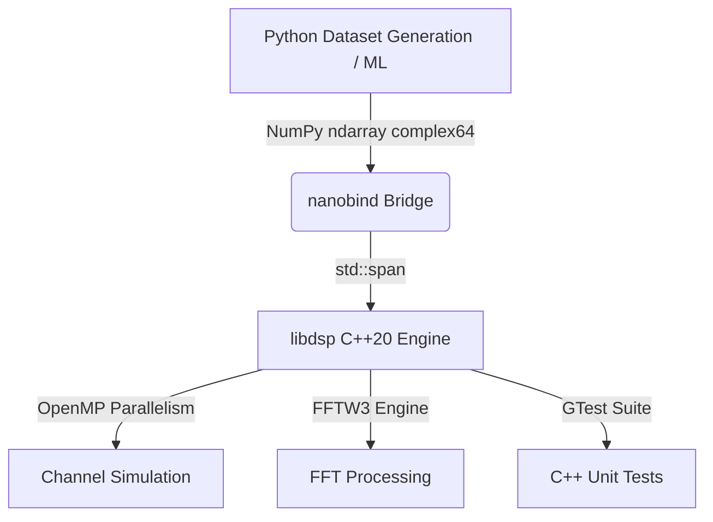

# SigFlow

[](https://en.cppreference.com/w/cpp/20)
[](https://www.python.org/)
[](https://visualstudio.microsoft.com/)
[](LICENSE)

SigFlow is a high-performance C++20 and Python RF signal processing and channel simulation toolkit. Designed for speed, reproducibility, and visual machine learning integration, SigFlow brings together hardware-accelerated DSP engines, complex multipath fading channel models, and modern Python deep-learning ready dataset pipelines.

---

## Key Features

*   **Native C++20 DSP Engine**: Fully vectorized signal pipelines compiled with the MSVC toolchain, incorporating dynamic multithreading via OpenMP.
*   **Modern Python Bindings**: Seamless integration between C++ arrays and NumPy complex64 buffers using nanobind for zero-copy memory transfers.
*   **Accurate RF Channel Simulator**: Real-time simulation of:
    *   AWGN (Additive White Gaussian Noise) with precise SNR settings.
    *   Rayleigh Fading (flat and frequency-selective multi-tap fading) supporting block-fading channel coherence.
    *   Doppler Shift with continuous, time-variant phase rotation.
*   **Clean Third-Party Integration**: Direct integration of FFTW3 and Google Test using CMake's FetchContent. No external dependencies or package managers required.
*   **Deep Learning Ready**: Complete dataset generation, pilot-aided channel estimation, MMSE equalization, and feature extraction (moments, instant frequency, histograms, log PSD bins) ready for neural network training.

---

## Repository Directory Structure

```text
SigFlow/
├── .vscode/                 # IDE workspace parameters (MSVC IntelliSense configurations)
├── libdsp/                  # Core C++20 DSP Library
│   ├── include/             # C++ Header files (dsp.h, channel.h)
│   ├── src/                 # C++ Implementation source & nanobind bindings
│   ├── tests/               # Google Test suite (test_dsp.cpp, test_channel.cpp)
│   └── build.ps1            # MSVC Windows C++ build & test execution script
├── python_src/              # High-Level Python Packages
│   ├── channel_estimation.py# Least-Squares Block estimation and MMSE equalizer
│   ├── dataset.py           # Modulation mapping (QPSK, 8PSK, 16QAM), dataset generator, and features extractor
│   ├── utils.py             # QPSK generators, hard decisions, pilots insertion and extraction
│   └── config.py            # Global simulation, ML features, and channel system parameters
├── test_pytest.py           # Fully integrated Pytest suite (63 test cases covering C++ and Python)
├── test_all.py              # Manual verification and sanity check scripts
└── pyproject.toml           # PEP 518/621 Python package configuration (scikit-build-core)
```

---

## Tech Stack & Architecture



*   **C++ Compiler**: Microsoft Visual C++ (cl.exe / VS 2022) with C++20 standards enabled.
*   **Parallelization**: OpenMP multithreading (/openmp).
*   **Fourier Transform**: FFTW3 (automatically fetched, linked dynamically with generated standard MSVC import libraries).
*   **Python Bindings**: nanobind 2.12+.
*   **Test Runner**: Google Test (for C++ targets), Pytest (for Python targets).
*   **Environment**: Python uv package manager.

---

## Getting Started

### 1. Prerequisites
- Windows OS
- Visual Studio 2022 (with Desktop development with C++ workload)
- uv (recommended) or Python 3.12+

### 2. Setting Up the Virtual Environment
Using uv to sync dependencies and set up the workspace:
```powershell
uv sync
```

### 3. Building the C++ Engine & Library
Run the pre-configured PowerShell build script to compile the core C++ engine, generate MSVC import libraries, build the nanobind module, and run the C++ unit tests:
```powershell
.\libdsp\build.ps1 -Clean
```
This builds python_src/libdsp.pyd and places libfftw3f-3.dll into the output folder automatically.

---

## Testing

SigFlow includes a comprehensive two-tier test suite covering the underlying C++ code and the high-level Python utilities.

### Running C++ Tests
To run only the C++ tests (testing raw DSP routines and channel models):
```powershell
.\libdsp\build.ps1 -TestOnly
```

### Running Python Tests
Our extended test suite is fully configured to run under uv without any configuration collision:
```powershell
uv run pytest
```
Tests verify:
- FFT energy conservation & conjugate symmetry.
- Rayleigh fading amplitude distributions and block fading coherence.
- Doppler phase rotation drift.
- QPSK constellations and BER (Bit Error Rate) calculations.
- Pilot-aided least-squares channel estimation and MMSE equalizer performance.
- Dataset generation shapes, formats (complex or stacked real-imag), and ML feature extraction.

---

## Usage Examples

### Python: Generating a Labeled RF Dataset
Generate a high-fidelity dataset of multiple modulations under Rayleigh fading and frequency offsets, ready for training classification networks:

```python
import python_src.dataset as dataset

modulations = ["BPSK", "QPSK", "8PSK", "16QAM"]
snr_levels = [5.0, 10.0, 15.0, 20.0]

X, y, meta = dataset.generate_dataset(
    mod_list=modulations,
    snr_db_list=snr_levels,
    examples_per_snr=100,
    samples_per_example=256,
    apply_flat_fading=True,
    fading_std=0.5,
    return_complex=False
)

# Output shape: (1600, 256, 2)
print("Dataset Shape:", X.shape)

features = dataset.extract_features(X)
# Output shape: (1600, 62)
print("Features Matrix Shape:", features.shape)
```

### C++ Core: Processing Signals & Impairments
You can use libdsp directly in native C++ projects. Link against dsp_core inside the built target:

```cpp
#include "dsp.h"
#include "channel.h"
#include <iostream>
#include <vector>
#include <complex>
#include <span>

int main() {
    using namespace sigflow;
    using cf32 = std::complex<float>;

    std::vector<cf32> signal(1024, cf32(1.0f, 0.0f));
    std::span<const cf32> signal_span(signal);

    std::vector<cf32> impaired = channel::apply(signal_span, 15.0f, 8, 100.0f);
    std::cout << "Impaired Signal Size: " << impaired.size() << std::endl;

    std::vector<cf32> spectrum = dsp::process(std::span<const cf32>(impaired), "fft");
    std::cout << "DC Spectrum Bin Magnitude: " << std::abs(spectrum[0]) << std::endl;

    return 0;
}
```

---

## Performance Tuning & Multithreading

The C++ core is optimized for parallel computation using OpenMP. By default, it will scale to utilize all available physical threads. To restrict or balance the processor usage (e.g. for cluster execution), set the standard OpenMP environment variable prior to execution:

**In PowerShell:**
```powershell
$env:OMP_NUM_THREADS = 4
```

**In Linux/Bash (when compiling on alternative setups):**
```bash
export OMP_NUM_THREADS=4
```

---

## License
This project is licensed under the MIT License - see the LICENSE file for details.
